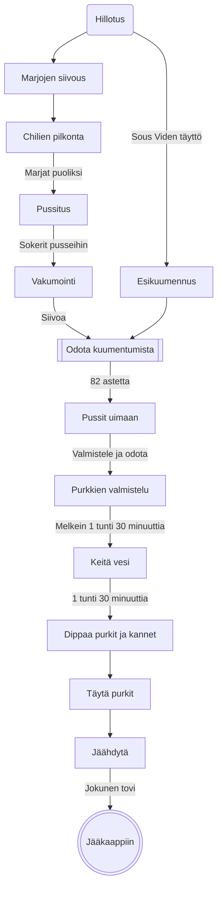

# Viinimarjachilihillo, v, g, l

Valmistusaika melkein kolme tuntia, josta suurin osa odottelua.

## Status

| Koska | Tila |
| -----|-------|
| 24.8.2024 | Purkitettu, ensimmäinen ajo |

## Idea

Paholaisen hillo on suosittu tuote, joka yhdistää makeaa, tulista ja hapanta mukavassa suhteessa. Punaiset viinimarjat ovat happamia, tuoreet punaiset chilit tulisia ja hillosokeri on makeaa. Yhdistelmän täytyy toimia!

Hillon [valmistamisessa](https://www.martat.fi/reseptit/hillo-pehmeakuorisista-marjoista/) on tapana keittää puhdistettuja tuotteita vähäisessä määrässä vettä ja joko pektiinin sekä sokerin kanssa tai suomalaisen hillosokerin kanssa - joka sisältää paitsi pektiiniä myös muita *"e-vitamiineja"*. 

Hillot on tapana tallettaa lasisiin kuumennettuihin tölkkeihin, niin että tölkit tulevat mahdollisimman täyteen - ilmeisesti mitä vähemmän ilmaa, sitä vähemmän pöpöjä - ja kansi kiinni. 

Miksi hilloa ei keitetä lasipurkeissa vesihauteessa? Silloin kuumennus sekä desinfioi lasipurkit, että tuotteeseen ei tarvitse lisätä vettä pohjaanpalamisen estämiseksi? Kantta ei varmaan purkkeihin voisi laittaa kuumennuksen ajaksi vai voiksiko? Eikö Sous Vide keittimeen voisi työntää hillopurkkeja kansineen ja asettaa lämmöksi vaikka 82 astetta ja hilloa syntyisi puolessatoista tunnissa?

Minä en tiedä voiko, mutta internetissä on kyllä ohjeita hillon valmistamiseen [Sous Videssä](https://recipes.anovaculinary.com/recipe/sous-vide-strawberry-rhubarb-jam). 

Minä en saa lasipurkkeihin tyhjiötä, enkä usalla uittaa niitä kansineen, joten yhdistellään ohjeita. Uskon kuitenkin, että jääkaapissa hilloni säilyvät avaamattomina useamman kuukauden ja avattuinakin ainakin yhden. Perustan uskoni siihen, että jäähtyvä hillo on niin kuumaa, että se mikä ehti kansitettaessa ja purkitettaessa kyytiin, kunhan purkki on riittävän täysi, kuolee kuumuuteen ennen kuin purkki jäähtyy.

## Työkalut

| Väline | Käyttö |
|--------|--------|
| Lävikkö | Marjojen huuhtelu |
| 1l mitta | Marjojen mittaus |
| 1dl mitta | Sokerin mittaus |
| Sous Vide-laite | Hillotus |
| Vakumointilaite | Vakuumipussien sulkeminen ja vakumointi |
| 2 vakuumipussia, noin 1l vetoisia | Marjojen hillotus |
| 1 keittiöveitsi | Chilien pilkkominen |
| leikkuulauta | Chilien pilkkominen |
| _lateksihanskat_ | Ei chiliä silmiin, hygienia |
| patalappuja | Ei polteta sormia |
| kattila | Purkkien kuumentamiseen |
| 2 noin 3dl hillopurkkia kansineen | Hillojen säilytykseen |
| vedenkeitin | Purkkien kuumentamiseen |
| sakset | Vakuumipussien avaamiseen |
| lautanen | Jotakin mihin nostaa märät purkit täytön ajaksi |
| metallilusikka | Täytön avuksi |
| rätti | Purkin kuivaamista varten |
| keittiöpihdit | Kansien kalastamista varten |

## Mitat

- 1 l punainen viinimarja
- 2 dl suomalainen hillosokeri
- 3 kpl punainen tuore chili

## Prosessi

Suurin osa valmistamisesta on odottelua. Eniten odotellaan Sous Videä, joten sen esilämmittämisestä 82&deg; asteeseen on hyvä aloittaa.Lämmityksen aikana ehtii siivota marjat ja pilkkoa chilit. 

Minä jaoin marjat kahteen yhtäsuureen osaan ja omiin pusseihinsa. Kumpaankin vakuumipussiin pistin 1dl hillosokeria ja toiseen myös pilkkomani chilit. Ravistelin pusseja, jotta sokeri jakautuisi tasaisemmin tuotteisiin.

Molemmat pussit vakumoin ja suljin.

Uitto 82&deg; puolitoista tuntia. Sillä aikaa kun pussit uivat voi hyvin valmistella purkkien dippaamista kiehuvaan veteen. Minulla on iso kattila ja vedenkeitin. Pistin kaksi hillopurkkia  sekä kannet tyhjään kattilaan ja vedenkeittimen täyteen odottamaan Sous Videä. 

Kun Sous Vide on valmis, kiehutetaan vesi. Kiehuva vettä kummankin purkin sisään, niin että vesi valuu reunoilta ylitse.Sama temppu kansille. Kuumat purkit nostetetaan yksitellen patalapuilla pois kattilasta, samalla tyhjentäen veden kattilaan, lautaselle täyttöä varten.

Saksilla vakuumipussi auki ja sisältö tölkkiin, lusikalla tarvittaessa auttaen. Nosta kansi kattilasta pihdeillä ja kierrä patalapulla kiinni purkkiin. Kuivaa purkki rätillä ja nosta jäähtymään pöydälle. Toista toiselle purkille ja pussille.

Anna jäähtyä huoneenlämpöiseksi ja pistä jääkaappiin.

## Havainnot / opit

- 24.8.2024 / Mai, liian vähän tuotetta purkkeihin, selvitä purkkien vetoisuus ja mittaa tuotteiden määrä ennen kuumennusta! Näyttää tosi irtonaiselta ja marjat kaikkea muuta kuin hilloisilta. Ehkä murskaat marjat ennen vakumointia seuraavalla kerralla? Ehkä enemmän sokeria? 
