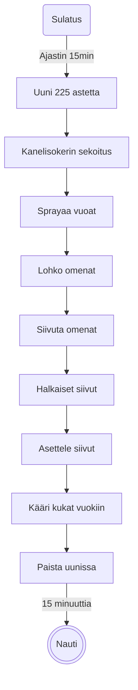

# Omenaruusut, v, g, l

Valmistusaika noin vartti ja toinen uunissa.

## Status

| Koska | Tila |
| ------| -----|
| 24.8.2024 | Vaihto filotaikinasta lehtitaikinaan, ensimmäinen ajo |

## Idea

Amerikkalaisilla on lehtitaikinasta tehty [omenaherkku](https://www.puffpastry.com/recipe/apple-roses/)], joka näyttää ruusulta. Samasta teemasta on variaatioita filotaikinalla. Syksyllä aina jostakin putkahtaa omenia, joista pitää päästä eroon. Kaupasta saa valmista lehtitaikinaa levyinä ja minulla on mahdoliini. Miksipä siis ei?

### Työkalut

| Väline | Käyttö |
| -------|--------|
| Keittiöveitsi | Omenien lohkominen ja leikkaaminen |
| Leikkuulauta | Omenien lohkominen ja leikkaaminen |
| 2kpl "Muffinsivuoka" kuusikoloinen | Paistaminen |
| Leivinpaperiarkki | Taikinan sulattaminen ja käsittely |
| Mandoliini | Omenien siivuttaminen |
| Uuni | Paistaminen |
| Uuniritilä | Paistaminen |
| Vuokasrpay | Vuokien voitelu |
| Silikonisuti | Vuokien voitelu |
| Patalaput | Kuumien asioiden käsittely |
| Matala muovikippo | Kanelisokerin sekoittaminen |
| Teelusikka | Kanelisokerin sekoittaminen ja annostelu |
| Ajastin | Paistoajan seuranta |

## Mitat

- 3kpl Omena
- 1tl jauhettu kaneli
- 1pkt 500g Myllynparas vegaaninen, gluteeiniton, laktoositon taikinalevy (8kpl)
- 3tl hienosokeri

## Prosessi

Laita leivinpaperiarkki pöydälle ja nostele taikinalevyt siihen sulamaan. Ajastimeen vartti. Pistä uuni lämpiämään 225 asteeseen, ei kiertoilmaa. Mittaa kaneli ja sokeri matalaan astiaan, sekoita. Voitele vuoat vuokaspräyllä ja siisti silikonisudilla.

Omenat tummuvat nopeasti, joten jos et tykkää katsella tummuneita siivuja, odottele kunnes ajastin on soinut ja toimi sitten valoa nopeammin. Tai älä välitä ja jatka heti.

Leikkaa omena siemenkodan kummaltakin puolelta. Saat kaksi melkein puolikasta omenaa. Siivuta puolikkaat mandolinilla. Leikkaa siivut puoliksi ja saat suunnillee puolikuita.

Asettele puolikuut vähän päällekäin kunkin taikinalevyn toisen pitkittäisen sivun yläreunaan niin, että kaareva osa tulee hivenen reunan ylitse.

[Rullatut](/Kuvat/Vaiheet/Omenaruusut.jpg)

Levitä omenoiden _juureen_ kanelisokeria. Taita lehtitaikinalevy pituussuunnassa, niin että puolikuut pilkistävät taitoksen yläreunasta. Rullaa pituussuunnassa ja saat ruusuja. Asettele rullat vuokaan ja pistä uuniin. Vartti uunissa ritilän päällä keskitasolla.

Ohut omena palaa helposti, katso että kiertoilma ei ole päällä, tai voi käydä niin, että ruusujesi terälehdet palavat.

## Havainnot / opit

- 24.8.2024 / Mai Älä käytä liian kypsiä omenoita, ne tummuvat kun katsot niitä, siivut liimautuvat toisiinsa ja hajoavat. Älä käytä kiertoilmaa, ohuet siivut palavat.